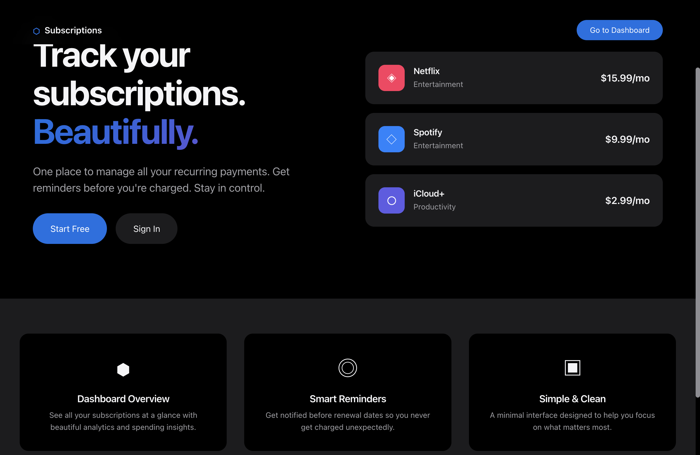
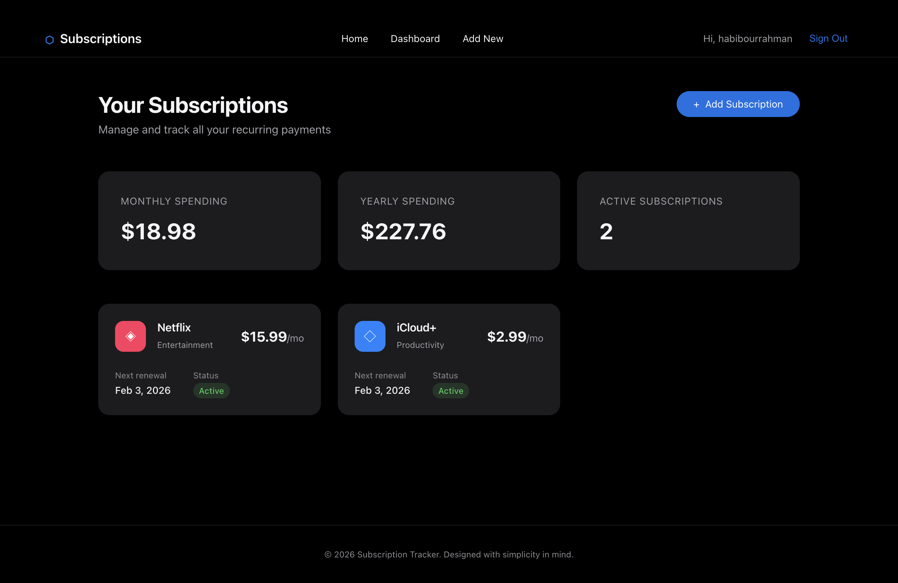
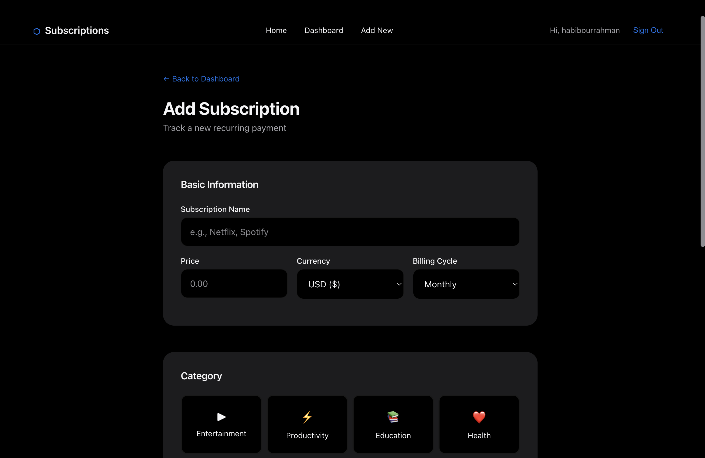

# 💳 Subscription Tracker

A full-stack subscription management application with an **Apple-inspired minimal UI/UX**. Track your Netflix, Spotify, and other recurring subscriptions in one beautiful dashboard.



---

## 🎯 Project Overview

**Subscription Tracker** helps users manage their recurring subscriptions by providing:

- 📊 Visual dashboard with spending analytics
- 🔔 Smart email reminders before renewal dates
- 💰 Monthly/yearly cost breakdown
- 🗂️ Subscription categorization (Entertainment, Productivity, Health, etc.)

---

## 📸 Screenshots

### Dashboard View



### Subscription Creation



---

## 🛠️ Tech Stack

### Frontend

| Technology                | Purpose                         |
| ------------------------- | ------------------------------- |
| **React 19**              | UI Library with latest features |
| **Vite 7**                | Lightning-fast build tool       |
| **React Router 7**        | Client-side routing             |
| **Axios**                 | HTTP client with interceptors   |
| **CSS Custom Properties** | Apple-inspired design system    |

### Backend

| Technology             | Purpose                   |
| ---------------------- | ------------------------- |
| **Node.js + Express**  | REST API server           |
| **MongoDB + Mongoose** | NoSQL database            |
| **JWT**                | Secure authentication     |
| **bcryptjs**           | Password hashing          |
| **Arcjet**             | Rate limiting & security  |
| **Upstash Workflow**   | Background job scheduling |
| **Nodemailer**         | Email notifications       |

---

## 🏗️ Architecture

```
┌─────────────────────────────────────────────────────────────┐
│                        FRONTEND                              │
│  React + Vite (Port 5173)                                   │
│  ┌─────────┐  ┌─────────┐  ┌─────────────┐                  │
│  │ Landing │  │  Auth   │  │  Dashboard  │                  │
│  │  Page   │  │ Pages   │  │   + CRUD    │                  │
│  └────┬────┘  └────┬────┘  └──────┬──────┘                  │
│       └────────────┼──────────────┘                         │
│                    ▼                                        │
│            ┌──────────────┐                                 │
│            │  Axios API   │ ← JWT Token Interceptor         │
│            │   Layer      │                                 │
│            └──────┬───────┘                                 │
└───────────────────┼─────────────────────────────────────────┘
                    │ HTTP Requests
                    ▼
┌─────────────────────────────────────────────────────────────┐
│                        BACKEND                               │
│  Express.js (Port 5500)                                     │
│  ┌──────────────────────────────────────────────────────┐   │
│  │                    Middlewares                        │   │
│  │  ┌─────────┐  ┌──────────┐  ┌─────────────────────┐  │   │
│  │  │  CORS   │  │  Arcjet  │  │  JWT Auth Verify    │  │   │
│  │  │         │  │  Shield  │  │                     │  │   │
│  │  └─────────┘  └──────────┘  └─────────────────────┘  │   │
│  └──────────────────────────────────────────────────────┘   │
│                           │                                  │
│  ┌────────────────────────▼─────────────────────────────┐   │
│  │                      Routes                           │   │
│  │  /api/v1/auth     → Sign Up, Sign In, Sign Out       │   │
│  │  /api/v1/users    → Get User Profile                 │   │
│  │  /api/v1/subscriptions → CRUD Operations             │   │
│  │  /api/v1/workflow → Email Reminder Scheduler         │   │
│  └──────────────────────────────────────────────────────┘   │
│                           │                                  │
│  ┌────────────────────────▼─────────────────────────────┐   │
│  │                   Controllers                         │   │
│  │  Business logic, validation, error handling          │   │
│  └──────────────────────────────────────────────────────┘   │
│                           │                                  │
└───────────────────────────┼─────────────────────────────────┘
                            │
                            ▼
┌─────────────────────────────────────────────────────────────┐
│                       DATABASE                               │
│  MongoDB Atlas                                              │
│  ┌─────────────────┐      ┌─────────────────────────────┐   │
│  │     Users       │      │      Subscriptions          │   │
│  │ ─────────────── │      │ ─────────────────────────── │   │
│  │ • _id           │◄────►│ • _id                       │   │
│  │ • username      │      │ • userId (ref)              │   │
│  │ • email         │      │ • name                      │   │
│  │ • password      │      │ • price                     │   │
│  │ • createdAt     │      │ • currency                  │   │
│  └─────────────────┘      │ • frequency                 │   │
│                           │ • category                  │   │
│                           │ • startDate                 │   │
│                           │ • renewalDate               │   │
│                           │ • status                    │   │
│                           └─────────────────────────────┘   │
└─────────────────────────────────────────────────────────────┘
```

---

## 🔐 Authentication Flow

```
┌──────────┐         ┌──────────┐         ┌──────────┐
│  Client  │         │  Server  │         │ MongoDB  │
└────┬─────┘         └────┬─────┘         └────┬─────┘
     │                    │                    │
     │ POST /auth/sign-up │                    │
     │ {email, password}  │                    │
     │───────────────────►│                    │
     │                    │ Hash password      │
     │                    │ with bcrypt        │
     │                    │───────────────────►│
     │                    │     Save user      │
     │                    │◄───────────────────│
     │   { token, user }  │                    │
     │◄───────────────────│                    │
     │                    │                    │
     │  Store token in    │                    │
     │  localStorage      │                    │
     │                    │                    │
     │ GET /subscriptions │                    │
     │ Authorization:     │                    │
     │ Bearer <token>     │                    │
     │───────────────────►│                    │
     │                    │ Verify JWT         │
     │                    │ Extract userId     │
     │                    │───────────────────►│
     │                    │  Find by userId    │
     │                    │◄───────────────────│
     │  { subscriptions } │                    │
     │◄───────────────────│                    │
     │                    │                    │
```

---

## 📁 Project Structure

```
subscription_tracker/
├── subscription_tracker_backend/
│   ├── app.js                    # Express server entry point
│   ├── config/
│   │   ├── arcjet.js            # Rate limiting config
│   │   ├── env.js               # Environment variables
│   │   └── upstash.js           # Background jobs config
│   ├── controllers/
│   │   ├── auth.controllers.js  # Sign up/in/out logic
│   │   ├── subscriptions.controllers.js
│   │   ├── user.controller.js
│   │   └── workflow.controllers.js
│   ├── database/
│   │   └── mongodb.js           # MongoDB connection
│   ├── middlewares/
│   │   ├── arcjet.middlewares.js
│   │   ├── auth.middlewares.js  # JWT verification
│   │   └── error.middlewares.js
│   ├── models/
│   │   ├── subscriptions.models.js
│   │   └── users.models.js
│   ├── routes/
│   │   ├── auth.routes.js
│   │   ├── subscription.routes.js
│   │   ├── user.routes.js
│   │   └── workflow.routes.js
│   └── utils/
│       └── sendEmail.js         # Nodemailer setup
│
├── subscription_tracker_frontend/
│   ├── src/
│   │   ├── api/
│   │   │   ├── auth.js          # Axios config + auth API
│   │   │   └── subscriptions.js # CRUD API functions
│   │   ├── components/
│   │   │   ├── Layout.jsx       # Navbar + wrapper
│   │   │   └── SubscriptionCard.jsx
│   │   ├── context/
│   │   │   └── AuthContext.jsx  # Global auth state
│   │   ├── pages/
│   │   │   ├── Landing.jsx
│   │   │   ├── Login.jsx
│   │   │   ├── Signup.jsx
│   │   │   ├── Dashboard.jsx
│   │   │   └── AddSubscription.jsx
│   │   ├── App.jsx              # Routes + protected routes
│   │   └── index.css            # Apple design system
│   └── vite.config.js
│
├── ui/                          # Screenshots
└── package.json                 # Root with concurrently
```

---

## 🚀 Getting Started

### Prerequisites

- Node.js 18+
- MongoDB Atlas account (or local MongoDB)
- npm or yarn

### 1. Clone the repository

```bash
git clone https://github.com/habibour/subscription_tracker.git
cd subscription_tracker
```

### 2. Backend Setup

```bash
cd subscription_tracker_backend
npm install
```

Create `.env` file:

```env
PORT=5500
MONGODB_URI=mongodb+srv://<username>:<password>@cluster.mongodb.net/subscription_tracker
JWT_SECRET=your_super_secret_key
JWT_EXPIRES_IN=7d

# Optional: Email notifications
EMAIL_HOST=smtp.gmail.com
EMAIL_PORT=587
EMAIL_USER=your_email@gmail.com
EMAIL_PASS=your_app_password
```

### 3. Frontend Setup

```bash
cd subscription_tracker_frontend
npm install
```

### 4. Run Both Servers (Development)

From the root directory:

```bash
npm install
npm run dev
```

This runs both frontend (port 5173) and backend (port 5500) concurrently.

---

## 🔌 API Endpoints

### Authentication

| Method | Endpoint                | Description        |
| ------ | ----------------------- | ------------------ |
| POST   | `/api/v1/auth/sign-up`  | Create new account |
| POST   | `/api/v1/auth/sign-in`  | Login & get JWT    |
| POST   | `/api/v1/auth/sign-out` | Logout             |

### Subscriptions (Protected)

| Method | Endpoint                    | Description                |
| ------ | --------------------------- | -------------------------- |
| GET    | `/api/v1/subscriptions`     | Get all user subscriptions |
| GET    | `/api/v1/subscriptions/:id` | Get single subscription    |
| POST   | `/api/v1/subscriptions`     | Create subscription        |
| PUT    | `/api/v1/subscriptions/:id` | Update subscription        |
| DELETE | `/api/v1/subscriptions/:id` | Delete subscription        |

### Users (Protected)

| Method | Endpoint        | Description              |
| ------ | --------------- | ------------------------ |
| GET    | `/api/v1/users` | Get current user profile |

---

## ✨ Key Features Implementation

### 🎨 Apple-Inspired Design System

The UI follows Apple's design principles with:

- **SF Pro-inspired typography** using system fonts
- **Subtle gradients** and glass morphism effects
- **Smooth 60fps animations** with CSS transitions
- **Consistent spacing** using 4px grid system
- **Dark-friendly color palette** with CSS custom properties

### 🔒 Secure Authentication

- Passwords hashed with **bcrypt** (10 salt rounds)
- **JWT tokens** with configurable expiration
- **HTTP-only considerations** for token storage
- **Axios interceptors** for automatic token injection

### 🛡️ Rate Limiting & Protection

- **Arcjet** integration for DDoS protection
- Request throttling per IP
- Bot detection and blocking

### ⏰ Smart Reminders

- **Upstash Workflow** for scheduled background jobs
- Email reminders 7 days before renewal
- Day-of renewal notifications

### 📧 Email Notification System

The app automatically sends email reminders to help users never miss a renewal:

```
┌─────────────────────────────────────────────────────────────┐
│                  EMAIL REMINDER WORKFLOW                     │
├─────────────────────────────────────────────────────────────┤
│                                                              │
│  User adds subscription with renewal date: Jan 15           │
│                     │                                        │
│                     ▼                                        │
│  ┌─────────────────────────────────────┐                    │
│  │  Upstash Workflow schedules jobs:   │                    │
│  │  • 7 days before (Jan 8)            │                    │
│  │  • 5 days before (Jan 10)           │                    │
│  │  • 2 days before (Jan 13)           │                    │
│  │  • Day of renewal (Jan 15)          │                    │
│  └─────────────────────────────────────┘                    │
│                     │                                        │
│                     ▼                                        │
│  ┌─────────────────────────────────────┐                    │
│  │     Nodemailer sends email:         │                    │
│  │  "Your Netflix subscription         │                    │
│  │   ($15.99/month) renews in 7 days"  │                    │
│  └─────────────────────────────────────┘                    │
│                                                              │
└─────────────────────────────────────────────────────────────┘
```

**How it works:**

1. When a subscription is created, a workflow is triggered via Upstash
2. The workflow calculates reminder dates based on the renewal date
3. At each scheduled time, Nodemailer sends a formatted email
4. Users receive timely reminders to cancel or prepare for charges

---

## 🧪 Testing the API

### Using cURL

**Sign Up:**

```bash
curl -X POST http://localhost:5500/api/v1/auth/sign-up \
  -H "Content-Type: application/json" \
  -d '{"username":"john","email":"john@test.com","password":"password123"}'
```

**Sign In:**

```bash
curl -X POST http://localhost:5500/api/v1/auth/sign-in \
  -H "Content-Type: application/json" \
  -d '{"email":"john@test.com","password":"password123"}'
```

**Create Subscription (with token):**

```bash
curl -X POST http://localhost:5500/api/v1/subscriptions \
  -H "Content-Type: application/json" \
  -H "Authorization: Bearer YOUR_JWT_TOKEN" \
  -d '{
    "name": "Netflix",
    "price": 15.99,
    "currency": "USD",
    "frequency": "monthly",
    "category": "entertainment",
    "startDate": "2026-01-01"
  }'
```

---

## 📚 What I Learned

Building this project helped me understand:

1. **Full-Stack Architecture** - How frontend and backend communicate via REST APIs
2. **Authentication** - JWT tokens, bcrypt hashing, protected routes
3. **State Management** - React Context API for global state
4. **API Design** - RESTful conventions, middleware patterns
5. **Database Design** - MongoDB schemas, relationships, indexing
6. **Security** - CORS, rate limiting, input validation
7. **Modern React** - Hooks, Context, React Router v7

---

## 🔮 Future Improvements

- [ ] OAuth integration (Google, GitHub login)
- [ ] Dark/Light theme toggle
- [ ] Push notifications (PWA)
- [ ] Subscription analytics charts
- [ ] Export data to CSV/PDF
- [ ] Multi-currency support with conversion
- [ ] Mobile app with React Native

---

## 👨‍💻 Author

**Habibour**

- GitHub: [@habibour](https://github.com/habibour)

---

## 📄 License

This project is open source and available under the [MIT License](LICENSE).

---

<p align="center">
  Made with ❤️ and lots of ☕
</p>
